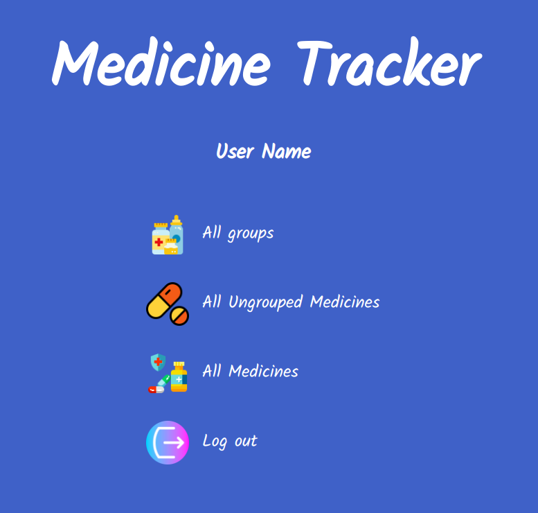

# Medicine Tracker

First of all, you can find this project's requirements [here](https://www.notion.so/Group-our-transactions-ccea2b6642664540a70de9f30bdff4ce).

The desisn colors and layout were created by [Gregoire Vella](https://www.behance.net/gregoirevella).

In this project I:

- Used Ruby on Rails to implement a Medicine Tracker;
- Used HTML and SCSS to create the views;
- Used Capybara and Shoulda Matchers gems to run RSpec tests;
- Used gravatar image tag gem to import signed up users' profile pictures;
- Set up Rubocop in the repository;
- Used MVP architectural pattern;
- Configured RESTFUL routes;
- Used controllers to intercept user requests;
- Used assets pipeline;
- Connected Database to app;
- Used Active Record as ORM;
- Used Active Record associations to model real life system (based on Database schema);
- Used Active Record queries to translate app requirements to SQL queries;
- Used ActiveRecord validations;
- Passed user input from view through controller to model in a safe way;
- Avoided n+1 queries problems;
- Deployed the app to Heroku;
- Translated business requirements into software solutions;
- Multitasked and effectively manage time and prioritization;
- Used strong English verbal communication;
- Used strong English written communication;
- Communicated information effectively to technical people.

# What it does

- When the App is executed, you can create a new user by providing name and username;
- When logged in, the user can create groups of medicine for control;
- The list of all created groups can be found by clicking on "All Groups" in the main menu;
- The main function of the app is to allow users to insert medicines and dosage they want to track.

## Built with

Ruby on Rails, HTML and SCSS.

## Live Demo

[Click here to see it on Heroku!](https://dry-caverns-41294.herokuapp.com/)

## Getting Started

- Clone the project to your local machine;
- `cd` into the project directory;
- Run `bundle install` to install the necessary gems;
- Run `rails db:create`;
- Run `rails db:migrate`;
- Run `rails s` to start a server in your computer;
- In your browser address, type the following URL: [localhost:3000](localhost:3000);
- Enjoy the App and its functionalities!

## Running RSpec tests

- `cd` into the project directory;
- Run `bundle exec rspec`.

## Author

- Github: [@NiiazalyDzhumaliev](https://github.com/NiiazalyDzhumaliev)
- Twitter: [@Niiazaly1](https://twitter.com/Niiazaly1)
- Linkedin: [Niiazaly Dzhumaliev ](https://www.linkedin.com/in/niiazaly-dzhumaliev-117707132/)

## 🤝 Contributing

Contributions, issues and feature requests are welcome! Start by:

- Forking the project
- Cloning the project to your local machine
- `cd` into the project directory
- Run `git checkout -b your-branch-name`
- Make your contributions
- Push your branch up to your forked repository
- Open a Pull Request with a detailed description to the development branch of the original project for a review

## Show your support

Give a ⭐️ if you like this project!
